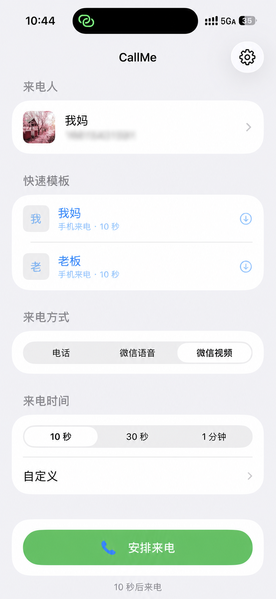
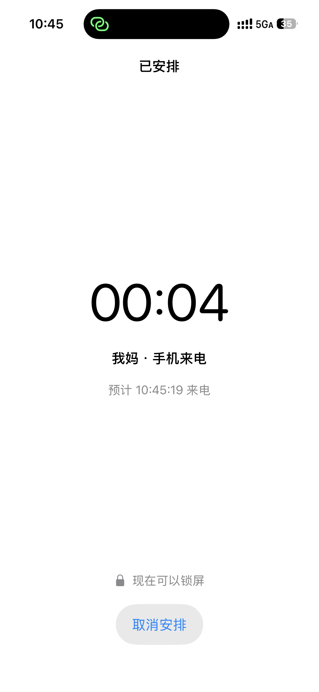
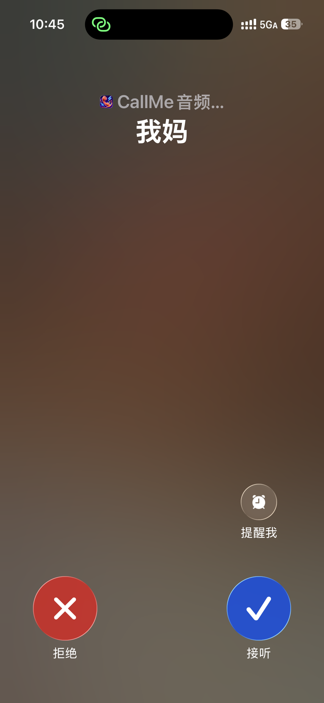
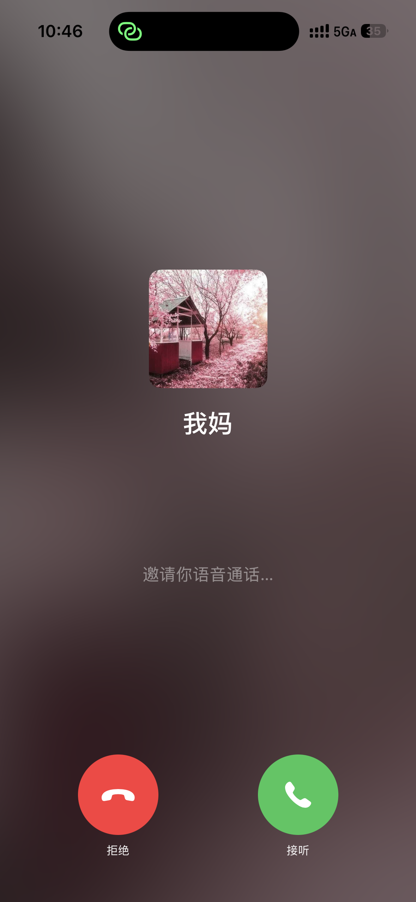
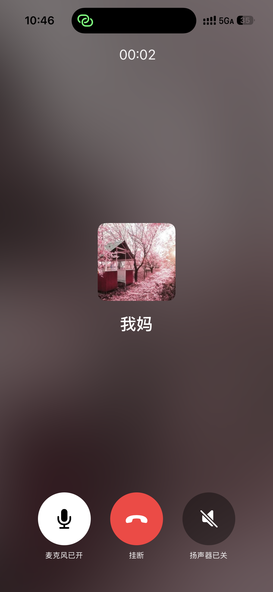
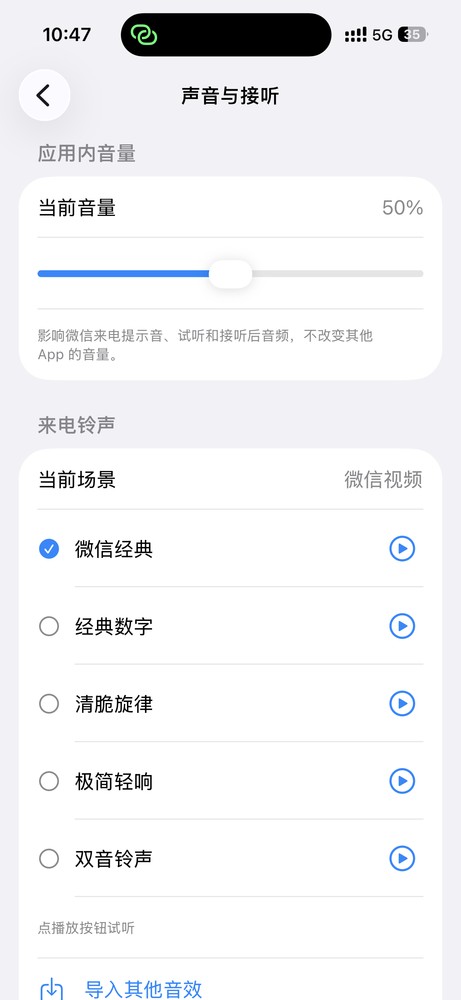

# CallMe

[中文](README.md) · [Installation](docs/INSTALLATION.en.md) · [Android notes](android/README.md)

CallMe is a personal, on-device incoming-call scheduler. When leaving a dinner, conversation,
meeting, or another awkward situation directly would feel uncomfortable, you can arrange a call
in advance, answer it when the phone rings, and use that moment to step away naturally. It works
on your own phone and does not require another person or device.

It is also a native mobile call-experience experiment. iPhone uses CallKit; Android uses Telecom,
exact alarms, and full-screen call notifications. WeChat-style voice and video calls use local
custom interfaces. CallMe does not connect to WeChat, place real calls, or use a server, account,
or cloud sync.

The workspace contains two independent apps:

- iOS 2.2 (SwiftUI + CallKit, iOS 16 or later)
- Android 0.24 (Kotlin + Jetpack Compose + Telecom, Android 8 or later)

> **Distribution notice:** the repository retains a classic WeChat ringtone extracted from the
> user's own device for local personal testing. It is not cleared for public redistribution.
> Keep a repository containing that file **private**, and do not publish APK, IPA, or Release
> artifacts containing it. See [`docs/audio-sources.md`](docs/audio-sources.md) for the other sounds.

## What you can use it for

- **Create a natural exit cue:** schedule a call before a dinner, gathering, or long conversation,
  then step away when it arrives.
- **Make a reminder hard to miss:** use ringing, screen wake, and an incoming-call surface instead
  of a quiet countdown.
- **Test platform behavior:** compare foreground, background, and lock-screen behavior across
  iPhone and Android device families.
- **Reuse familiar scenarios:** save caller names, avatars, call styles, timing, and answer audio as
  local templates.

### A 30-second exit example

1. Open CallMe and set the caller to “Boss.”
2. Choose Phone or WeChat Voice and select a 30-second delay.
3. Schedule the call, then return home or lock the device.
4. Answer when it rings, remain on the call surface briefly, and step away naturally.

> CallMe only presents the experience on your device. It does not contact the named person or
> create a real call or carrier charge.

## Screenshots

These are iPhone captures using a local example template. They show CallMe's on-device experience;
they do not represent a real carrier or WeChat call.

<p align="center">
  <br>
  <sub>Home overview: choose a caller, call style, and delay, then select “Schedule Call.”</sub>
</p>

<table>
  <tr>
    <td align="center" width="33%"><br><sub>After scheduling: countdown and lock-screen prompt</sub></td>
    <td align="center" width="33%"><br><sub>Phone call: answer or decline</sub></td>
    <td align="center" width="33%"><br><sub>Connected: audio, mute, keypad, and more controls</sub></td>
  </tr>
  <tr>
    <td align="center" width="33%"><br><sub>WeChat-style voice: local incoming screen</sub></td>
    <td align="center" width="33%"><br><sub>WeChat-style voice: connected controls</sub></td>
    <td align="center" width="33%"><br><sub>Sound settings: preview and choose the classic WeChat tone</sub></td>
  </tr>
</table>

Android phone UI varies with the current default phone app and device manufacturer. Screenshots of
Android's custom WeChat-style surfaces will be added separately after they are captured on a device.

## Bundled ringtones

The classic WeChat ringtone is included and referenced by both apps:

- iOS: `CallMe/WeChatClassic.mp3`
- Android: `android/app/src/main/res/raw/wechat_classic.mp3`

WeChat Voice and WeChat Video can select it as the built-in default. Other bundled choices include
digital, crystal, and minimal tones, and both apps support locally imported answer audio. The
system phone ringtone remains controlled by iOS or Android.

## Status and current capabilities

| Capability | iOS | Android | Evidence |
| --- | --- | --- | --- |
| Scheduled phone call | CallKit | Telecom / default phone app | Implemented; core flow tested on an iPhone and a Xiaomi device |
| WeChat-style voice call | Custom SwiftUI surface | Custom Compose surface | Implemented as local UI/audio simulation only |
| WeChat-style video call | Camera, local video, picture-in-picture | Camera, picture-in-picture, lens switching | Implemented; no real remote call |
| Caller customization | Name, number, avatar | Name, number, avatar | Implemented and stored locally |
| Delay | 1 second to 24 hours | 1 second to 24 hours | Foreground path works; long background timing is OS-dependent |
| Sound and answer audio | Built-ins, preview, local import | Built-ins, preview, local import | Implemented; system-phone audio remains OS-controlled |
| Templates and diagnostics | Local templates and event log | Local templates and event log | Implemented |

## How platform UI adaptation works

### iPhone

Phone-call mode is reported through CallKit, so iOS owns the incoming and connected call screens.
An app cannot redesign those system screens or bypass silent mode, Focus, or the system ringtone
volume for one CallKit provider.

WeChat-style voice and video use custom UI while the app is active. When the app is locked or sent
to the background, CallMe switches to CallKit to preserve ringing, screen wake, answer, and decline.
A normal local timer cannot guarantee arbitrary long delays after iOS suspends the app.

### Android UI strategy

Phone-call mode calls `TelecomManager.addNewIncomingCall`. The device's default phone app owns the
UI, so Xiaomi, Samsung, Huawei, and other devices naturally use their own system call style.

The WeChat-style surfaces are drawn by CallMe. Android 0.24 selects layout and settings profiles for
Xiaomi/Redmi/POCO, Huawei/Honor, OPPO/OnePlus/realme, vivo/iQOO, Samsung Galaxy, and Google/AOSP.
Only the Xiaomi profile has been calibrated against supplied device screenshots. The other profiles
are responsive baselines and must be refined with screenshots from those device families.

## Fastest test flow

1. Set the caller, call type, and delay.
2. Complete the permission checklist shown by the app.
3. Use the immediate preview to verify UI, ringtone, and answer controls.
4. Schedule a 10-second call, then return home or lock the device.
5. If it fails, copy the diagnostics report to identify whether timing, permissions, Telecom, or the
   custom call surface failed.

See [`docs/INSTALLATION.en.md`](docs/INSTALLATION.en.md) for complete setup instructions.

## Local build

### iOS

Open `CallMe.xcodeproj`, select your Personal Team under **Signing & Capabilities**, choose a unique
Bundle Identifier if needed, connect an iPhone with Developer Mode enabled, and run the app.

A free Apple ID can install the app on your own device, but Personal Team signing expires and needs
periodic reinstallation. Other long-term users either need to sign the project themselves with
Xcode or receive a build through an appropriate paid Apple Developer distribution path.

### Android build

```bash
cd android
./gradlew testDebugUnitTest assembleDebug
```

The debug APK is written to:

```text
android/app/build/outputs/apk/debug/app-debug.apk
```

Other testers can build it themselves or privately install a trusted APK after allowing installs
from the relevant source. They still need to grant notification, full-screen call, exact alarm,
camera, and phone-account permissions, plus vendor-specific background or battery exemptions.

## Architecture

```text
Scheduled call
  ├─ iOS phone ───────────→ CallKit ─────────→ iOS system call UI
  ├─ iOS WeChat style ────→ foreground SwiftUI / background CallKit
  ├─ Android phone ───────→ AlarmManager → Telecom → default phone app
  └─ Android WeChat style → AlarmManager → ringing service → Compose full-screen UI
```

The Android app never calls `TelecomManager.placeCall()` and never places a real outgoing call.

## Verification

Android 0.24 passed `./gradlew testDebugUnitTest assembleDebug`, was installed on a Xiaomi
`2206122SC`, and reported `versionCode=24`. Manufacturer routing is unit-tested.

The iOS project includes `CallMeTests/CallExperimentRulesTests.swift`. A prior iPhone 16 / iOS 26.5
test verified a 10-second CallKit ring, screen wake, incoming call screen, answer, and decline.
Longer locked/background delays remain experimental and are not presented as reliable scheduling.

## Known limitations

- This is a prototype and platform-capability experiment, not a production communications product.
- iOS local background scheduling is subject to suspension; there is no PushKit, APNs, or server.
- Android full-screen notifications, exact alarms, and background launches vary by OS and vendor.
- System phone ringtone, volume, silent behavior, and UI are controlled by the OS/default phone app.
- WeChat-style UI and sounds do not imply authorization, affiliation, or endorsement.
- No open-source license has been selected. Until licensing and third-party asset scope are resolved,
  neither the code nor binaries should be assumed freely redistributable.
